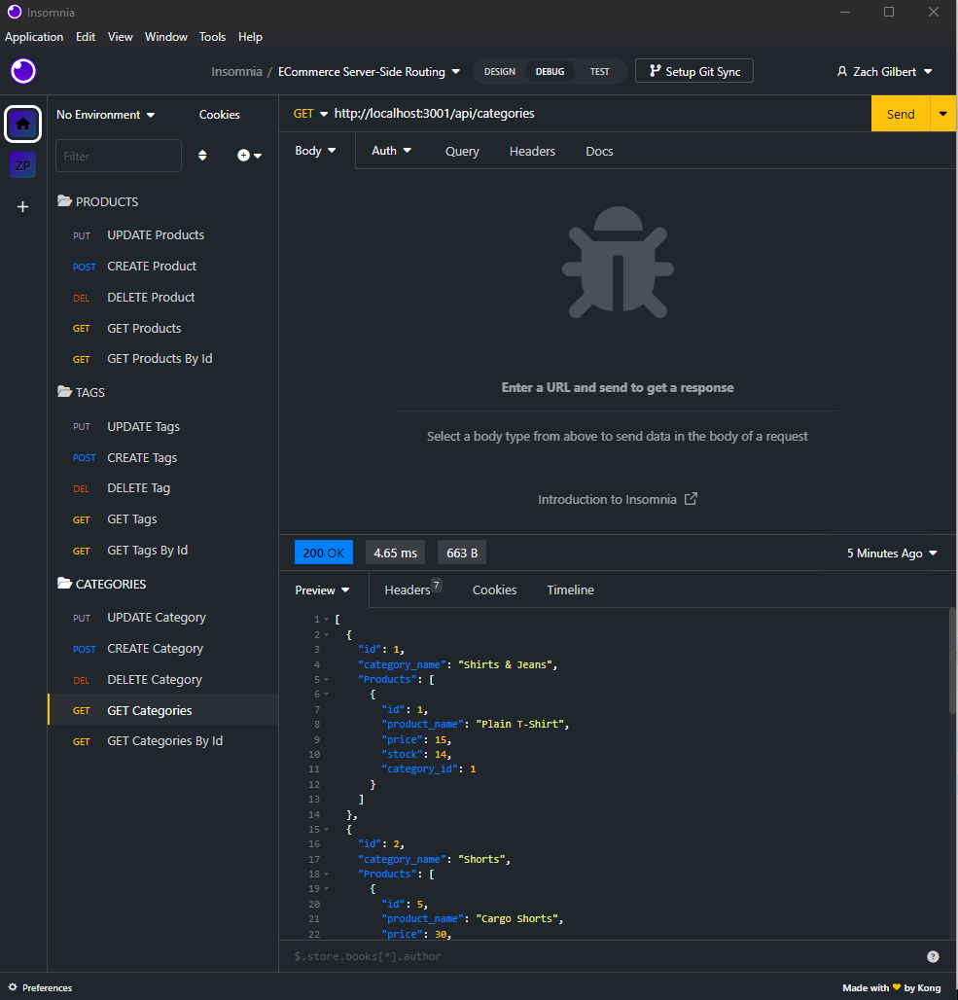
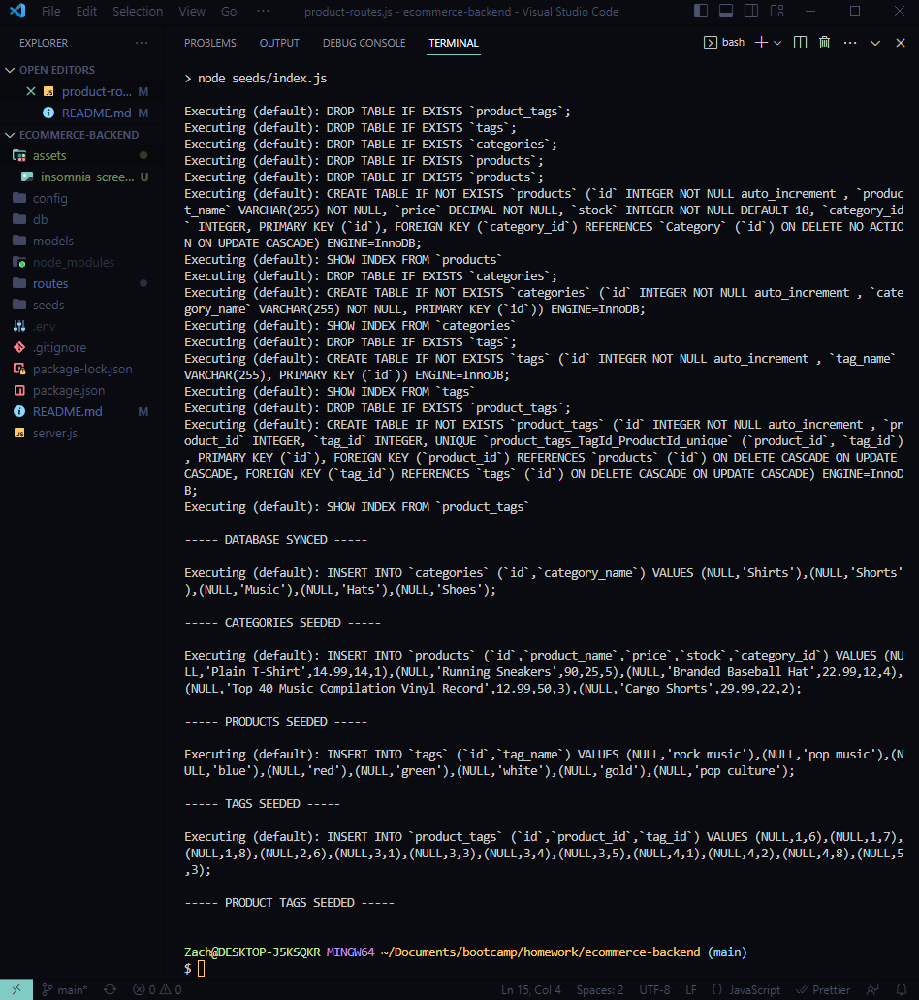
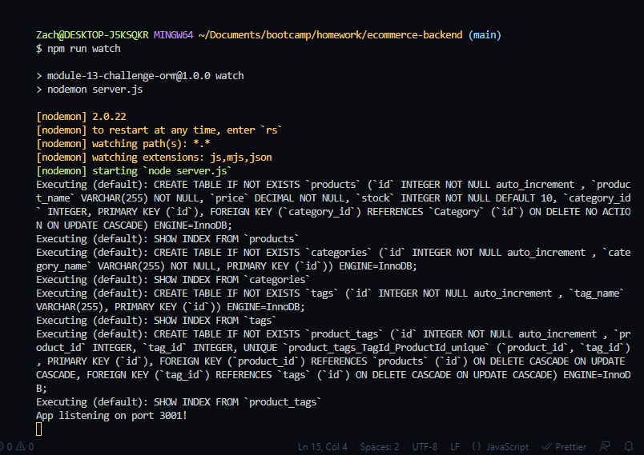

# Ecommerce Backend Database

## Description
My motivation for this project circled around understanding how routing works and how we have the ability to use ORM to create Models, which are essentially templates for database tables.
I built this project to learn more about how ORM brings all of the aforementioned processes together.
The ability for a company to have a fluid database that can be easily updated dynamically is crucially important in the fast-paced world of ecommerce. This server-side codebase is a way of showing how a company may accomplish this.
I certainly learned more about Object Relational Mapping and database interaction while diving further into the server-side. I also learned more about testing in Insomnia.
## Table of Contents
### [Installation](#installation)
### [Usage](#usage)
### [Screenshots](#screenshots)
### [Contributions](#contributions)
### [Tests](#tests)
### [Questions](#questions)
### [License](#license)
## Installation
The steps for proper installation involve opening the command line and running the following commands after cloning the code repository to the local machine: npm i -> mysql -u root -p/enter password -> SOURCE db/schema.sql -> quit -> npm run seed -> npm run watch. At this point all required dependencies should be downloaded, the database should be initiated and seeded in MySQL (the user may double-check for an "ecommerce_db" in the list of schemas at this point in MySQL workbench), and the server port will be synced to the models in the codebase and listening on the local port 3001.
## Usage
Once the user has successfully opened the local port and the app is "listening" Insomnia may be opened and the user may test the RESTful API route functionality to perform CRUD operations by manipulating the seeded data, adding more data or deleting data.
## Screenshots
  
## Contributions
No outside collaborators were involved on this project.

The third-party assets used were Insomnia and the Node packages mysql2, sequelize and express.

## Tests
All RESTful API route testing was done in Insomnia.
The user has the option to run any CRUD operation in Insomnia while the local port is open and listening.
## Questions
Please direct any further questions to: buster35 or gilb9711@gmail.com.
## License
The license used for this project is MIT: https://choosealicense.com/licenses/mit/#.
